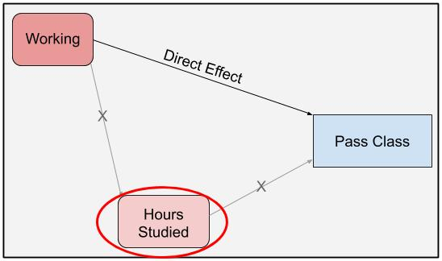
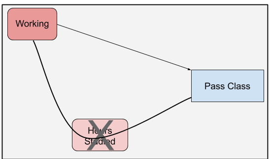

```{r setup, echo = F}
knitr::opts_chunk$set(echo = T,
                      message = F,
                      warning = F,
                      error = F)
```

## What is mediation analysis? {#introduction}

Let's say you want to examine the affect of employment on whether a student passes a class. You set up a cruel randomized controlled trial where some students are forced to work 15 hours a week and other are prohibited from working at all. You speculate that working students will perform worse because they have less time to study.

We can visually depict the causal relationships with the following Directed Acyclic Graph (DAG):

```{r mainDag, fig.cap = 'DAG highlighting the effect of working on passing a class', out.width = '50%'}
knitr::include_graphics(glue("dag/working_dag_main.png"))
```

As the graph shows, we might be interested in three different ways that working affects the probability of passing a class.

1.  *Direct Effect:* The direct effect is the effect that working has on class passage through a direct causal link. There is no intermediate cause between working and passing the class; at least none that we can measure.

2.  *Indirect Effect:* In our example, working's indirect effect on bar passage is its effect through hours studied. Working impacts hours studied and hours studied affects class passage.

3.  *Total Effect:* Total effect is the overall, all things considered, effect of working on passing. It's the direct effect plus the indirect effect.

The goal of mediation analysis is to disentangle these three effects.

THis post is my attempt to manually code a mediation analysis. There are packages that do it for you but I could not find one to fit my use case: mediation analysis using a Bayesian hierarchical logistic regression model and a Bayesian hierarchical linear regression. So, let's see if I can do it on my own!

Let's get set up with packages and a series of functions that I will repeatedly use.

```{r loadPackages}
library(rstanarm)
library(mediation)
library(tidybayes)
library(glue)
library(knitr)
library(ggeffects)
library(knitr)
library(tidyverse)

# stan options
# detect and use max number of cores
options(mc.cores = parallel::detectCores())

# create ggplot theme for this post
post_theme <- theme_minimal() +
  theme(legend.position = 'bottom',
        plot.title = element_text(size = 10),
        axis.title = element_text(size = 10))

theme_set(post_theme)

# set folder to import pictures
dag_folder <- "content/post/2020-11-25-bayesian-mediation-analysis/dag"
```


```{r customFunctions}
relabel_plot_color <- scale_fill_brewer(palette = "Set2", type = "Qual", labels = c(`0`= "Working", `1` = "Not working"))

posterior_diff <- function(mod, new_df, effect_type) {
  
  # create one column dataframe that is the difference in linear predictions for working and non-working students
  # parameters:
  #   mod: model
  #   new_df: dataframe to create predictions from
  #   effect_type: type of effect (indirect, direct, total)

  mod_post <- posterior_linpred(mod, newdata = new_df, transform = T,
                              seed = 1837, n = 500) %>%
    as.data.frame()
  
  col_split <- ncol(mod_post)/2
  
  mod_diff <- unlist(mod_post[1:col_split] - mod_post[(col_split+1):ncol(mod_post)])
  
  diff <- data.frame(diff = mod_diff,
                     type_effect = effect_type)
  
  return(diff)
}

posterior_diff_plot <- function(post_diff, x_limits, plot_title)  {
  
  # plot posterior distribution of difference in working and no-working predictions
  # parameters:
  #   post_diff: dataframe created from posterior_diff with predicted posterior 
  #     difference between workers and non-workers
  #   x_limits: plot x limits
  #   plot_title: title of plot
  
  ggplot(post_diff, aes(x =diff*100)) +
    stat_halfeye(alpha = .7) +
    scale_x_continuous(limits = x_limits) +
    labs(title = plot_title,
         x = 'Perc. point difference in probability of passing class\nNot working - working',
         y = 'Density',
         fill = NULL)
}

two_group_plot <- function(df, plot_title) {
  
  # plot posterior distribution of both workers and non-workers
  # parameters:
  #   df: dataframe for plotting; will be linear predictions for workers and non-workers
  #   plot_title: title of plot
  
  ggplot(df, aes(x = .value, fill = as.factor(work))) +
    stat_halfeye(alpha = .8) +
    scale_x_continuous(labels = scales::percent_format(accuracy = 1)) +
    relabel_plot_color +
    labs(title = plot_title,
         x = 'Probability of passing class',
         y = 'Density',
         fill = NULL)
}
```

## Untangling the Gordian Effects Knot

We'll simulate a data set to show the three types of effects outlined in the [introduction](#introduction). The fake data set includes three columns: (1) a 0 or 1 identifying whether the student worked, (2) a continuous number showing how many hours the student studied in the given week, and (3) a 0 or 1 signifying whether the student passed the class.

The code below creates the fake data.

```{r createDataset}
# create simulated dataset --------

# number of rows in dataset
n <- 500

# 1 if student works, 0 otherwise
work_order <- c(1, 0)
working <- rep(work_order, times = n/2)

# save for future use
work_string <- c('Working', 'Not working')

# create vector for hours studied that depends on whether the student worked
set.seed(2938)
study_hours <- rnorm(n, 
                     mean = 25 + (working*5),
                     sd = 10)

# create vector for passing the class
# value depends on both hours studied and whether the student worked
final_grade_formula <- (.05 + .015*study_hours + .04*working)
final_grade <- rnorm(n, mean = final_grade_formula, sd = .05)
final_grade <- ifelse(final_grade > 1, 1, final_grade)
final_grade <- ifelse(final_grade < 0, 0, final_grade)
final_grade <- rbinom(n = n, size = 1, prob = final_grade)

grades <- data.frame(
  work = working,
  study = study_hours,
  pass = final_grade
)
```

Here's a sample of the data set.

```{r}

kable(head(grades), digits = 2)
```

### Calcualting the direct effect the old fashioned way

In figure \@ref(fig:mainDag), the direct effect of working on passing the class is the causal line that does not go through hours studied. We calculate this through a single model that conditions on hours studied. By conditioning on hours studied, we block the path from working to course passage that flows through hours studied. This only leaves the direct effect path open.

```{r directDag, fig.cap = 'DAG highlighting the direct effect of working on passing a class', out.width = '50%'}

```

By conditioning on hours studied, the effect of working on passing represents the effect with hours studied being the same for both the working and non-working groups. We thus remove any effect working has on passage via creating differences in hours studied between workers and non-workers.

We can isolate the direct effect through a simple Bayesian logistic regression model with hours study and working status as predictors and whether the student passed as the response. By including hours worked as a predictor, we hold it constant when examining the relatinship between working and passing the class. The working regression coefficient then drives the direct effect.

```{r deMod, cache = T}
# logistic regression model to identify direct effect
full_mod <- stan_glm(pass ~ study + work, 
                     family = binomial('logit'),
                     seed = 938,
                     data = grades)

```

With our model in hand, we can now visualize the direct effect. One way is to predict class passage for workers and non-workers, while holding hours studied constant. In other words, we can use the model to predict class passage for the two following hypothetical students. The hours worked is the mean hours worked in our simulated data.

```{r}
# predictio ndataset
mean_hours <- mean(grades$study)

direct_prediction <- data.frame(
  work = work_order,
  study = mean_hours
)
```

Here is the posterior distribution of the probability of passing the class, grouped by whether students worked. We assume all students studied `r (mean_hours)` hours, the mean amount.

```{r dePlotDiff, fig.caption = "Direct effect: Difference in class passage probabilities between workers and non-workers, with hours studied held constant.", fig.height = 2.7, fig.width = 4}
full_mod %>%
  add_fitted_draws(newdata = direct_prediction, seed = 93, n = 300) %>%
  two_group_plot(glue("Prob. of Passing based on Work Status\nHours studied held constant at {round(mean_hours, 2)} Hours"))
```

We see that students who worked and a lower probability of passing the class compared to non-workers, even when accounting for hours studied. But, there is overlap in the probability distributions. 

We can better highlight the difference and uncertainty through the following steps:

1.  Create two posterior predictive distributions for passing the class for each student: one assuming the student worked and another assuming the student did not work.
2.  For each set of predictions (each student), subtract the posterior predictive distribution arising when the student works from the distibution occuring when the student does not work.

```{r}
# for each student (observations) create two predictions for passing the class, one if the student worked
# and anotehr if the student did not work

full_mod_newdata <- expand_grid(study = grades$study,
                                work = work_order) %>%
  arrange(desc(work), study) %>%
  as.data.frame()

# find differences in posterior distributions
direct_effect_post <- full_mod %>%
  posterior_diff(new_df = full_mod_newdata, effect_type = 'Direct Effect')
```

This difference is shown below. It gives us the posterior predictive distribution of the difference in passing the class between workers and non-workers, holding hours studied constant. It aligns with figure \@ref(fig:dePlotDiff), but puts more contours on the magnitude of the difference and its uncertainty. 

```{r iePlotDiff, fig.cap = "Direct effect of working on passing the class.", fig.height = 2.5, fig.width = 4}
posterior_diff_plot(direct_effect_post, x_limits = c(-15, 30), plot_title = 'Direct Effect of Working on Passing')
```

This gives us a much better picture of the difference in class passage probabilities between workers and non-workers. And we can also use the posterior distribution of differences to calculate probabilities such as the probability that the direct effect is positive.

### Total effect the old fashioned way

The total effect is the effect of working on class passage through all causal links originating with working. In figure \@ref(fig:mainDag), its the effect that goes straight from working to class passage and the effect that runs through hours studied. We calculate this effect by failing to condition on hours studied. By removing hours studied from the equation, the effect that previously traveled through hours studied now goes directly to class passage. This allows us to merge the two lines into one.

```{r teDag, fig.cap = 'DAG highlighting the effect of working on passing a class', out.width = '50%'}

```

We can estimate the total effect by a Bayesian logistic regression model with work status as the lone predictor and class passage as the response.

```{r teMod, cache = T}
# total effect model
total_effect <- stan_glm(pass ~ work, 
                         family = binomial('logit'),
                         seed = 938,
                         data = grades)
```

As with the direct effect, we can plot the posterior predictive distributions of workers and non-workers.

```{r tePlotPosterior, fig.height = 3, fig.width = 4}
total_effect %>%
  add_fitted_draws(newdata = data.frame(work = work_order), seed = 93, n = 300) %>%
  two_group_plot('Prob. of Passing based on Work Status')
```

We can also focus on the difference and calculate the posterior predictive distribution representing the difference in class passage between workers and non-workers.

```{r tePlotDiff, fig.height = 2.5, fig.width = 4}
diff_limits <- c(-10, 35)

total_effect_post <- total_effect %>%
  posterior_diff(new_df = data.frame(work = work_order), effect_type = 'Total Effect')

posterior_diff_plot(total_effect_post, x_limits = diff_limits, plot_title = 'Total Effect of Working on Passing')
```

The total effect shown in figure \@ref(fig:tePlotDiff) is larger than the direct effect from figure \@ref(fig:tePlotDiff). This is expected. The total effect includes the effect of studying on passage, while the direct effect does not. Since this effect is positive, we would expect the total effect to be larger.

### Indirect effect (kind-of) the old fashioned way

Calculating the indirect effect is more challenging. We want to calculate the effect of working on passing the class that arises because of the effect of working on number of hours studied. Our speculation on the indirect effect is that working causes students to study less, which then leads to them being less likely to pass the class. We'll divide the analysis into two steps.

#### Step 1: Effect of working on number of hours studied

The first step is the easiest. We estimate the effect of working on hours studied with a simple linear regression model containing working as the predictor and hours studied as the response.

```{r ieModel, cache = T}
# indirect effect model
indirect_effect1 <- stan_glm(study ~ work, 
                         family = 'gaussian',
                         seed = 938,
                         data = grades)
```

Here's the posterior predictive distribution of the hours studied for workers and non-workers. Unsuprisingly, non-workers study more.

```{r iePlotPosterior, fig.height = 3, fig.width = 4}
indirect_effect1 %>%
  add_fitted_draws(newdata = data.frame(work = work_order), seed = 1837) %>%
  two_group_plot('Effect of Working on Hours Studied') +
  scale_x_continuous() +
  xlab('Hours studied')
```

#### Step 2: Effect of studying on passing after incorporating the effect of working on studying

Now for the tricky part. We want to first create predictions from the model we just created. These predictions represent the number of hours a student studies based on whether the student worked. We'll then take these predictions and feed them into a model with hours studied and working status as predictors. This is the full model. The predictions from this model tell us our indirect effects.

*Raw effect of studying on passing*

```{r iePlot2, fig.height = 3.5, fig.width = 3.5}
ggpredict(full_mod, c("study [10:35]", "work"), seed = 39) %>%
  plot() +
  scale_color_brewer(palette = "Set2", type = "Qual", labels = c("Working", "Not working")) +
  labs(title = 'Probability of Passing Class',
       x = 'Hours studied',
       y = 'Probability of passing',
       color = NULL) +
  theme(legend.position = 'bottom',
        plot.title = element_text(size = 10))
```

*Effect of studying on passing, while incorporating effect of working on studying*

Step 1: predict studying values for workers and non-workers, while holding work status constant.

```{r}
# posterior draws of work to study model
ie1_post_pred <- indirect_effect1 %>%
  add_fitted_draws(newdata = data.frame(work = work_order), n = 300, seed = 893) %>%
  ungroup() %>%
  select(work_original = work, study = .value) %>%
  mutate(work = 1)

ie1_post_pred <- ie1_post_pred %>%
  group_by(work, work_original) %>%
  median_hdci(study) %>%
  select(work, work_original, study)

kable(head(ie1_post_pred, 10), digits = 2)
```

```{r}
ie1_post_pred <- data.frame(
  work = c(1, 1),
  study = c(25, 30),
  work_original = c(1, 0)
)

indirect_effect_post <- full_mod %>%
  add_fitted_draws(newdata = ie1_post_pred, n = 300, seed = 76) %>%
  ungroup()

indirect_effect_post %>%
  group_by(work_original) %>%
  median_hdci(.value)

ie2_post_pred0 <- indirect_effect_post %>%
  filter(work_original == 0) %>%
  mutate(.row = .row - 300) %>%
  select(work_study = study, .row, .draw, value_work = .value)

ie2_post_pred1 <- indirect_effect_post %>%
  filter(work_original == 1) %>%
  select(notwork_study = study, .row, .draw, value_notwork = .value)

indirect_effect_post_diff <- ie2_post_pred0 %>%
  left_join(ie2_post_pred1, by = c('.row', '.draw')) %>%
  mutate(diff = value_notwork - value_work,
         type_effect = 'Indirect Effect')
```


```{r fig.height = 3, fig.width = 4}
indirect_effect_post %>%
  select(work = work_original, .value) %>%
  two_group_plot('Probability of Passing Class by Work Status')
```

```{r fig.height = 2.5, fig.width = 4}
posterior_diff_plot(indirect_effect_post_diff, x_limits = c(-100, 100), plot_title = 'Indirect Effect of Working on Passing')
```

### Compare results to `mediation` package

```{r}
med_fit <- lm(study ~ work, data = grades)

out_fit <- glm(pass ~ work + study,
              data = grades, family = binomial("logit"))

med_out <- mediate(med_fit, out_fit, treat = "work", mediator = "study",
                  robustSE = TRUE, sims = 500)

# get estimates and cnof. intervals for frequentist effect size estimates with mediation package

# dataframe of confidence intervals, with two columns (one for lower and upper bounds)
# will be used for plotting effect sizes
upper_lower_ci <- bind_rows(med_out$z.avg.ci, med_out$d.avg.ci, med_out$tau.ci)

mediation_effects <- tibble(
  effect_type = c('Direct Effect', 'Indirect Effect', 'Total Effect'),
  effect_size = c(med_out$z.avg, med_out$d.avg, med_out$tau.coef),
  lower_ci = upper_lower_ci[[1]],
  upper_ci = upper_lower_ci[[2]],
  effect_group = 'Frequentist (mediation package)'
)

# get 95% credible intervals for bayesian effects
bayes_effect <- bind_rows(list(direct_effect_post, indirect_effect_post_diff, total_effect_post)) %>%
  group_by(type_effect) %>%
  median_hdi(diff)
```

```{r raceMediation, fig.cap = "Direct, indirect, and total effects of working on class passage. Values are the average percentage point difference in class passage.", fig.height = 3.5, fig.width = 5}
bayes_effect %>%
  select(effect_type = type_effect, effect_size = diff, lower_ci = .lower, upper_ci = .upper) %>%
  mutate(effect_group = "Bayesian Mediation") %>%
  bind_rows(mediation_effects) %>%
    ggplot(aes(effect_size, fct_rev(effect_type), color = effect_group)) +
    geom_point() +
    geom_segment(aes(x = lower_ci, xend = upper_ci, yend = effect_type)) +
    geom_vline(xintercept = 0, alpha = .6) +
    scale_color_brewer(palette = "Set2", type = "Qual") +
    scale_x_continuous(labels = scales::percent_format(accuracy = 1)) +
    facet_wrap(~effect_group, ncol = 1) +
    labs(title = 'Cumulative Effects of Race on Bar Passage',
           x = "Percentage point difference (Non-workers minus Workers)\nIn avg. probability of class passage",
           y = NULL) +
    theme(legend.position = 'none')
```
## The versitility of mediation analysis

